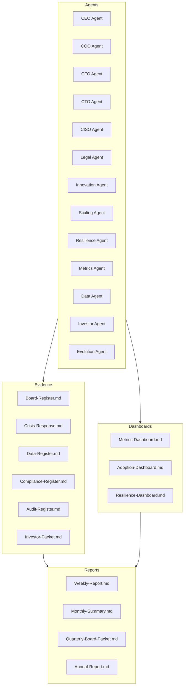

# PayMate AI – Contributor Guide

This guide explains how contributors can run the orchestrator, initialize evidence files, and generate reports. It complements `README.md` and `README-contributor.md`.

---

## 🚀 Setup

1. **Install dependencies**

   ```bash
   npm install
   ```


