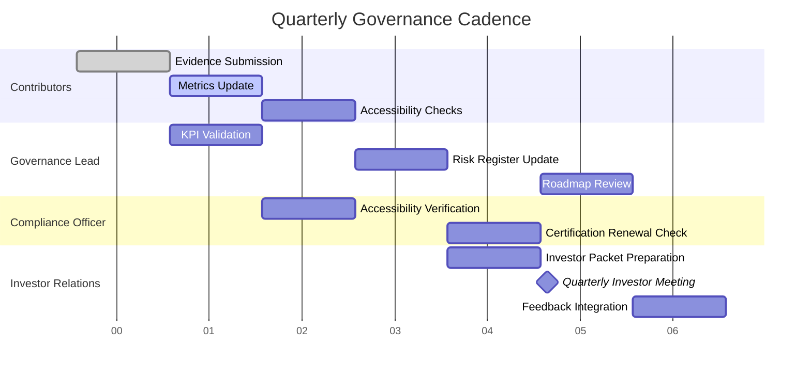

# PayMate AI – Governance Dashboard Governance Cadence Diagram

Purpose
Visualize the quarterly governance cadence using a timeline diagram.  
Provides contributors, auditors, and investors with a clear view of deadlines and milestones.

