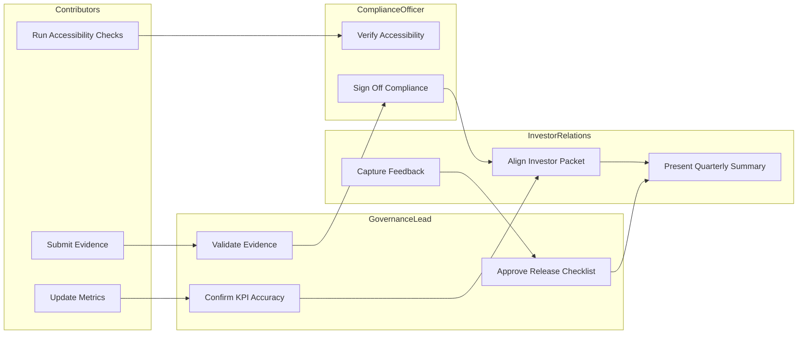

# PayMate AI – Quarterly Governance Workflow Diagram

Purpose
Visualize the flow of responsibilities across contributors, governance lead, compliance officer, and investor relations during a quarterly cycle.  
Ensures clarity, accountability, and transparency in dashboard operations.

