# PayMate AI – Governance Dashboard Repo Map (Visual)

Purpose
Provide a visual diagram of how all governance dashboard documents interconnect.  
Helps contributors and investors quickly understand the repo structure.

```mermaid
graph TD

    A[Master Index] --> B[Governance & Operations]
    A --> C[Risk, Evidence & Compliance]
    A --> D[Investor Engagement]
    A --> E[Release & Roadmap]

    %% Governance & Operations
    B --> B1[Governance Guide]
    B --> B2[Training Module]
    B --> B3[Contributor Handbook]
    B --> B4[Operations Playbook]

    %% Risk, Evidence & Compliance
    C --> C1[Risk Register]
    C --> C2[Continuous Improvement Log]
    C --> C3[Audit Evidence Log]
    C --> C4[Certification Register]

    %% Investor Engagement
    D --> D1[Investor Feedback Log]
    D --> D2[Investor Communication Guide]
    D --> D3[Investor Meeting Template]
    D --> D4[Investor Q&A Module]
    D --> D5[Investor Summary Template]
    D --> D6[Investor Packet Outline]

    %% Release & Roadmap
    E --> E1[Release Checklist]
    E --> E2[Release Notes Template]
    E --> E3[Roadmap]
    E --> E4[Maturity Model]
```

